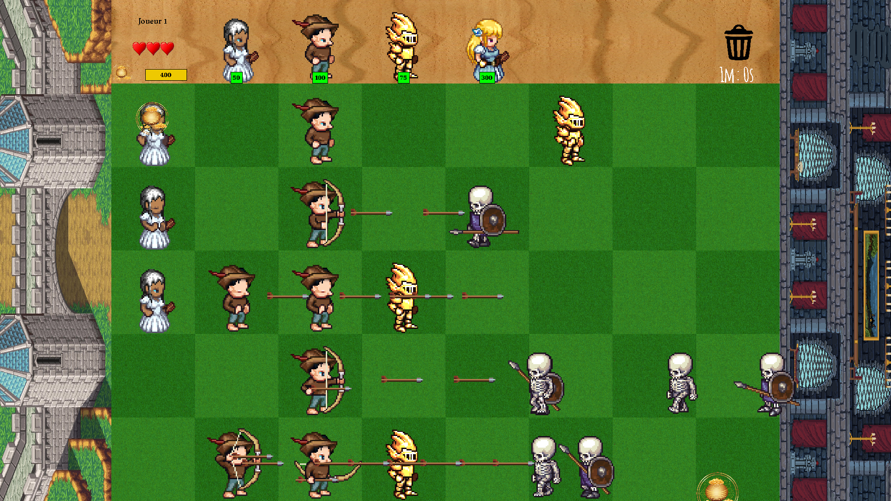
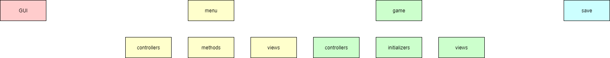
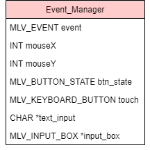
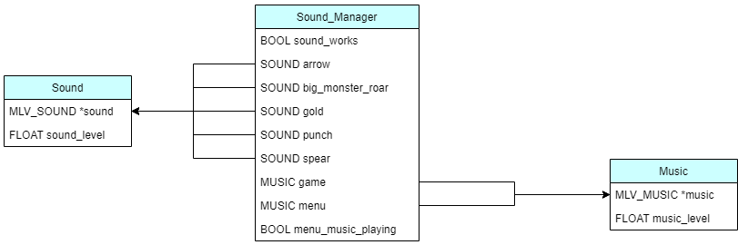
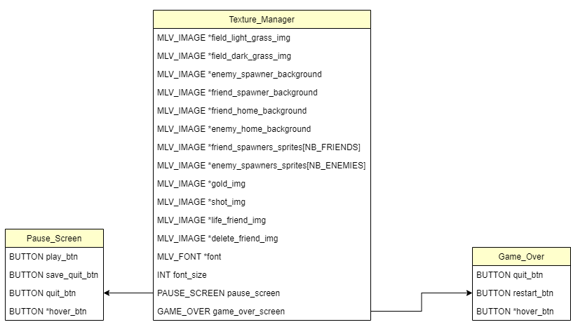
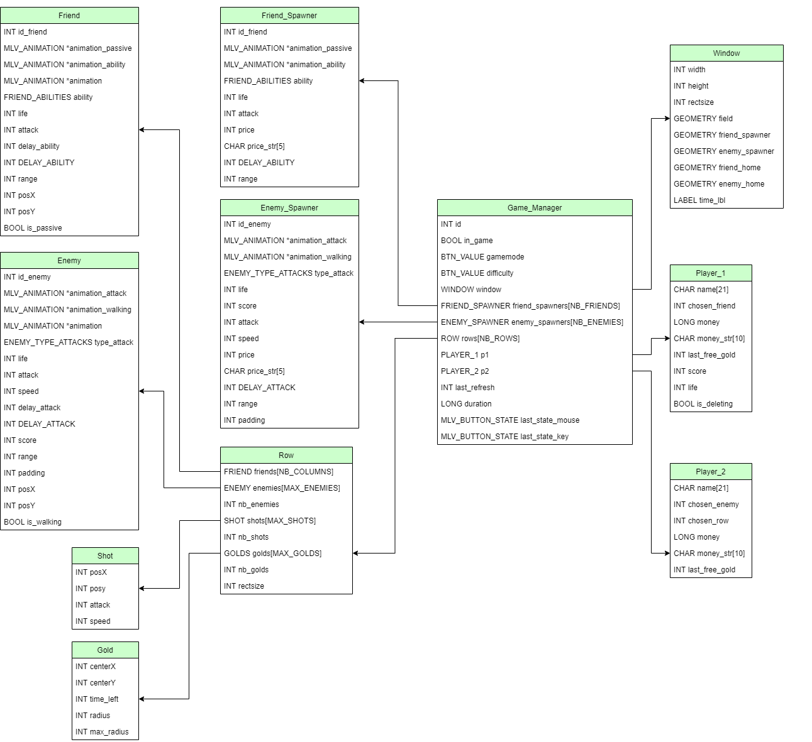

# Ein Stone
***
Ein Stone est un jeu inspiré du célèbre Plants VS Zombies. Un joueur affronte au choix, soit l'ordinateur, soit un autre joueur, le but est de survivre le maximum de temps à l'invasion ennemie en achetant des alliés et en les posant sur le terrain.

 

----------------------------------------------------------------------------------------------------------

## Architecture des fichiers
Le projet est très largement inspiré du modèle MVC sans pour autant respecter strictement les conventions.
Nous avons décidé de nous orienter sur un modèle similaire au MVC car il semblait important pour nous de séparer la vue (dessin des éléments, récupération des évenements) du contrôle (création de nouvel ennemie, allié, déplacement des flèches...).
Le projet se subdivise en 4 grandes parties:
* GUI: la partie qui concentre la création de boutons/inputs/labels et qui les gères.
* menu: la partie qui se concentre sur la gestion du menu, en se servant notamment de la partie GUI.
* game: la partie qui gère le jeu.
* save: la partie qui gère la sauvegarde des scores et des parties sauvegardées.

Chaque partie est développé dans la même logique, mais l'organisation des différents modules/dossiers est différente. Le but étant de limiter la taille des fichiers pour une lecture améliorée du code source.

------------

### GUI
La partie GUI comporte simplement 4 fichiers: button.c, input.c, label.c et general.c.
button.c, input.c et label.c contiennent les fonctions de dessin des éléments, mais aussi de création et de gestion.
C'est ici qu'on trouvera les fonctions permettant de rendre un élément *hover* ou *select*.
Le fichier general.c est légerement différent, il comporte les fonctions affectant plusieurs éléments différents. On aura par exemple ici la fonction permettant d'affecter une taille de police optimale pour un objet donné, ou encore la fonction permettant de dessiner soit un input, soit son label correspondant selon les action de l'utilisateur.
C'est aussi dans le fichier general.c que l'on retrouve la redefinition des structures MLV_List, _MLV_list, _MLV_Input_box. Cela nous permet de récupérer la valeur d'un input sans que le joueur n'ai besoin de valider l'inptu en cliquant sur la touche <Entré>.

------------

### MENU
La partie MENU se décompose en 3 sous dossiers (controllers/methods/views) et un fichier menu.c.
Chaque page du menu est en fait un objet, une structure en C.
L'objet Main_Page comprend un label (le titre) et 4 boutons: "New Game", "Resume", "Scores", "Quit" ainsi qu'un pointeur sur l'un de ses boutons: "hover_btn".
Cette logique permet de savoir en permanence le bouton survolé par l'utilisateur, ce qui permet de redessiner la page uniquement sur le "hover_btn" change.

#### controllers
Dans le dossier controllers se trouve simplement 4 fichiers correspondant aux 4 pages. Chaque fichier gère les actions de l'utilisateur, le changement de page, la préparation au lancement du jeu etc...

#### methods
Le dossier methods comprend là aussi 4 fichiers, chacun responsable des méthodes d'une page.
Les fichiers les plus basiques comprennent les fonctions d'initialisation des pages (création des objets aux bonnes positions) et les fonctions permettant de retourner le bouton survolé de la page.
Les fichiers plus complexes possèdent en plus les fonctions permettant par exemple de transformer l'input d'une page en label.

#### views
Le dossier views ne comporte en réalité qu'un seul fichier draw_menu.c. Ce fichier est constitué des fonctions permettant de dessiner chaque page du menu, essentiellement en appelant les fonctions de dessin du dossier GUI.
C'est aussi dans la vue que l'on retrouve la fonction get_event() permettant de retourner l'action de l'utilisateur sur une page.

#### menu.c
Le fichier menu.c est le point d'entrée du programme. C'est ici que se trouve la fonction main(), que le gestionnaire de sons est initialisé et que la fenêtre est créée.

------------

### GAME
La partie GAME se décompose encore une fois en 3 sous dossiers (controllers/initializers/views) et d'un fichier game.c
Le jeu est logiquement composé d'une multitudes de structures différentes, reliés entres-elles dans une structure très importante: Game_Manager.
Une partie entière est consacré aux structure plus bas dans le document.

#### controllers
Dans le dossier controllers se trouve les fichiers permettant de gérer les principales structures du projet, notamment les alliés avec le fichier friend.c, les ennemies avec enemy.c, le joueurs, les lignes du terrain etc...

#### initializers
Comme son nom l'indique, le dossier initializers contient les fonctions d'initialisation des structures.

#### views
Le dossier views comporte le fichier chargé de dessiner le jeu, qui va faire appel aux fonctions des deux autres fichiers de la vue, draw_objects pour dessiner les alliés, les ennemies, les flèches etc.. et draw_window pour dessiner la fenêtre, les spawners, le terrain etc...

#### game.c
Le fichier game.c est le fichier principal du jeu. C'est ici que l'on retrouvera les fonctions en charge d'interpréter les actions de l'utilsiateurs et d'appeler les bonnes fonctions après un clique, une touche du clavier etc...
C'est ce fichier qui met à jour les éléments du jeu en permanence.

------------

### SAVE
La partie SAVE permet de gérer les sauvegardes.
Constitué d'un seul et unique fichier, on y retrouve les fonctions permettant de sauvegarder une partie, l'ajouter dans les scores, retourner une liste d'objets Game_Manager correspondant aux parties sauvegardées.

----------------------------------------------------------------------------------------------------------

## Convention de nommage des fonctions

### Les fonctions init_*...*(*paramètres*)
Les fonctions init_*...*(*paramètres)* retourne une structure initialisée.

### Les fonctions get_new_*...*(*paramètres*)
Ce type de fonctions créé et retourne une nouvelle structure initialisée.

### Les fonctions set_*...*(*paramètres*)
Ce type de fonctions met à jour certaines valeurs d'une structure. Rien n'est retourné.

### Les fonctions get_*...*(*paramètres*)
Similaire aux fonctions *get_new...(paramètres)* mais sans pour autant être spécifique aux structures. Retourne une structure, une variable, un pointeur...

### Les fonctions update_*...*(*paramètres*)
Les fonctions de mise à jour se retrouvent dans les contrôleurs et vont appeler un certain nombre de fonctions. Rien n'est retourné.

### Les fonctions is_*...*(*paramètres*)
Vérifie une condition et retourne une variable booléenne vrai ou faux.

### Le mot clé *this*
On utilise le mot clé this dans beaucoup de fonctions. Lorsqu'une fonction a pour objectif la modification d'un structure, on utilisera le mot clé *this* pour identifier cette structure.
On retrouvera par exemple la fonction update_row(Row **this**, ...) ou encore la fonction remove_friend_in_row(Friend **this**, ...) et bien d'autre encore...

----------------------------------------------------------------------------------------------------------

## Structures

Nous allons voir ici les structures dont se ser le jeu pour fonctionner.
Nous n'expliquerons pas les structures des boutons, inputs, label ou encore les pages du menu car cela semble suffisemment clair sans avoir besoin de rajouter des informations.

### Event_Manager
 
Cette structure très simpliste est très utilisé tout au long du programme, non seulement dans le jeu, mais aussi dans le menu.
C'est cette structure qui va permettre de récupérer toutes les informations à la suite d'une action de l'utilisateur.

------------

### Sound_Manager
 
Le Sound_Manager est, comme son nom l'indique, le gestionnaire de sons.
Le variable booléenne "sound_works" est primordiale, elle permet de s'assurer lorsque le jeu est lancé que le son fonctionne bien, sans quoi le programme renverrai une erreur de segmentation lorsqu'un son voudra être joué (sur WSL tout particulièrement, le son ne marche pas sans télécharger d'autres plugins).

------------

### Texture_Manager
 
Le Texture_Manager est constitué d'une multitude d'images, toutes utiles lors du dessin du jeu. Nous avons ensuite une police d'écriture qui est chargée en débt de partie et sauvegardé, c'est celle-ci qui est utilisée pour écrire les noms des joueurs sans avori besoin de charger une font à chaque actualisation.

------------

### Game_Manager
 
Enfin, la structure la plus imposante: le Game_Manager.
Cette structure possède:
* une variable permettant de savoir si le jeu est terminée ou en cours,
* deux variables pour le mode de jeu et la difficulté,
* une structure Window pour conserver les positions et les géométries des éléments de la fenêtre (posX du terrain, rectsize notamment),
* les informations des spawners alliés et ennemies (leur prix, leur attaque, leur vie etc..) dans lesquels on ira piocher pour créer de nouveaux alliés/ennemies,
* des structures Row, chacune représentant une ligne du terrain, avec une liste d'alliés, une liste et un nombre d'ennemies, une liste et un nombre de pièces d'or et une liste et un nombre de flèches,
* les informations sur les joueurs 1 et 2 (leur argent, le score du joueur 1, la dernière fois que le jeu leur a offert de l'or etc...),
* une variable pour la date du dernier rafraichissement de partie,
* une variable pour la durée de la partie,
* deux variables pour gérer lorsque MLV détècte quand le bouton (de la souris ou du clavier) est relâché mais pas lorsqu'il est appuyé.

Nous préciserons que dans le projet, nous utilisons fréquemment le terme de "pop" pour définir ensemble les pièces d'or et les flèches.

----------------------------------------------------------------------------------------------------------

## Fonctions principales

### void update_game(Game_Manager *GM, Texture_Manager *TM, Sound_Manager *SM)
On trouve cette fonction dans **/game/game.c** Cette fonction met à jour le jeu.
C'est à dire que:
* elle attent un délai ou une action de l'utilisateur,
* si la vie du joueur 1 est inférieure ou égale à 0, le jeu est perdu,
* si un délai est dépassé, le jeu fait apparaître une pièce sur le terrain,
* si un délai est dépassé, le jeu augmente l'or du joueur 2,
* si le joueur 2 n'est pas un joueur réel, on met à jour l'IA (cf plus bas),
* si un délai est dépassé, on met à jour toutes les lignes du plateau (cf plus bas),
* si le joueur a cliqué sur la souris, la fonction *mouse_action* est appelée,
* si le joueur a appuyé sur une touche, la fonction *keyboard_action* est appelée,
* si la variable *in_game* est vraie, le jeu est redessiné et la fonction s'auto-appelle.

### void update_row(Row *this, Game_Manager *GM, Sound_Manager *SM)
On trouve cette fonction dans **game/controllers/row.c**. Cette fonction met à jour une ligne du plateau.
C'est à dire que:
* elle met à jour tous les alliés de la ligne,
* elle met à jour tous les ennemies de la ligne,
* elle met à jour tous les tirs de la ligne,
* elle met à jour les collisions de la ligne,
* elle met à jour les pièces d'or.

### void update_all_collisions_in_row(Row *this, Sound_Manager *SM, int *p1_score)
On trouve cette fonction dans **game/controllers/row.c**. Cette fonction cherche toutes les collisions d'une ligne.
C'est à dire que:
* pour chaque tir sur une ligne,
* la position du tir est comparée avec la positions des ennemies de la ligne,
* si les positions coincident, le tir est supprimé, l'ennemie est blessé (tué si sa vie descend à 0).

### void update_IA(Game_Manager *GM)
On trouve cette fonction dans **game/controllers/IA.c**. Cette fonction met à jour l'IA.
C'est à dire que:
* elle récupère les lignes avec la plus faible densité d'allié,
* elle récupère la somme des points de vie des alliés par ligne,
* elle récupère le nombre minimal d'alliés par ligne,
* celon son nombre minimal, un ennemie est choisit au hasard et envoyé sur une ligne considérée comme faible.